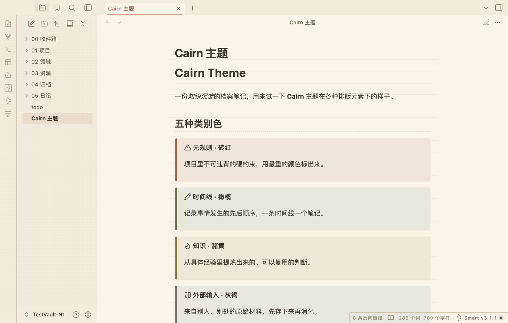
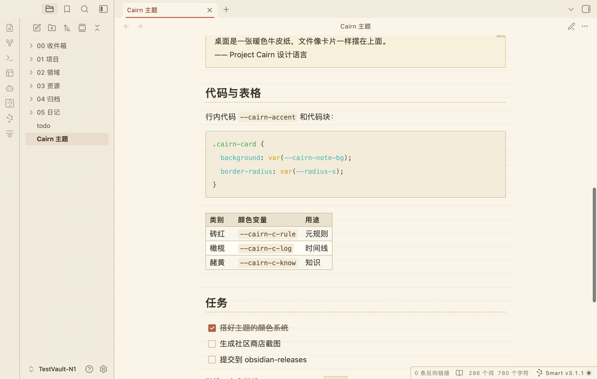

# Cairn

*Read this in: **English** | [中文](README.zh-CN.md)*

A kraft-paper archive for Obsidian — your vault as physical files on a warm
paper desk.

Warm paper neutrals, brown ink, a single terracotta accent, and clean
sans-serif type. Corners are small and archival, shadows are warm brown rather than
gray, and surfaces carry a faint CSS paper grain. No pure white, no pure black,
no cool grays anywhere.

## Screenshots

Headings and the five-colour callout system:



Blockquote card, code block, table and task list:



Cairn implements the [Project Cairn](https://github.com/iBlinkQ/project-cairn)
design language. Its five category colors — 砖红 meta-rule, 橄榄 timeline,
赭黄 knowledge, 灰褐 external input, 青灰 process artifact — are mapped onto
Obsidian's callout types, so a callout is color-coded the same way a file card
is in the Cairn visualization.

The file explorer is left on Obsidian's own structure and takes the palette
only — paper ground, ink labels, a terracotta marker on the open file. Blockquotes
are paper cards with a turned-down corner.

Type scale, line width and spacing follow Obsidian's own conventions rather
than the design system's landing-page values: 16px body, 42rem measure, 1.8
line height, em-relative headings. Wide letter-spacing is kept as a brand
signature but restricted to labels — status bar, table headers, property keys —
so Chinese body text keeps its rhythm.

### Fonts

Cairn defaults to a system sans-serif stack: `-apple-system, "PingFang SC",
"Microsoft YaHei", "Noto Sans SC", sans-serif`. Community themes may not load
remote assets, so no webfont is fetched — the stack falls through to whatever
sans faces your system has.

To use a different font, pick it in **Settings → Appearance → Font** (text,
interface and monospace separately). Cairn only fills Obsidian's theme font
slots, so your choice there always wins — headings and the inline title follow
it too. No plugin needed.

## Install

**From Obsidian** — Settings → Appearance → Themes → Manage → search for `Cairn`.

**Manually** — download `manifest.json` and `theme.css` from the
[latest release](../../releases/latest) into
`<vault>/.obsidian/themes/Cairn/`, then pick Cairn under Settings → Appearance.

## Customise

Install the [Style Settings](https://github.com/obsidian-community/obsidian-style-settings)
plugin to adjust Cairn without writing CSS:

- accent, note surface, desk surface, ink and hairline colors (light and dark
  set separately)
- default font stack, line height, line width
- corner radius
- paper stock — ruled / aged / plain / flat, plus ruled line color, aged wash and quote card paper
  (drops all texture), plain quote (drops the blockquote card), underlined
  internal links, dimmed interface, block cursor

## Development

Source lives in `src/` as numbered modules; `theme.css` at the repo root is the
concatenated build output and should not be edited by hand.

```bash
npm run build   # src/ -> theme.css
npm run sync    # build, then copy into the test vault
npm run dev     # rebuild and sync on every change
npm run check   # build, then check against the Obsidian theme guidelines
```

`npm run check` fails the build on `!important`, `@import`, remote assets in
`url()`, unbalanced braces, or a missing light/dark block — the same things the
directory review looks for. It then reads the palette out of
`src/02-color-light.css` and `src/03-color-dark.css` and fails if any text
color drops below WCAG AA (4.5:1) on the surface it is actually painted on.
Two values are exempt, each for a stated reason in `contrast.mjs`.

Dark mode is an extension, not source material — the Cairn Design System ships
light only. The dark palette keeps the brand's warm brown bias throughout.

The sync target defaults to the `TestVault` under iCloud. Point it elsewhere
with the `OBSIDIAN_THEME_DIR` environment variable:

```bash
OBSIDIAN_THEME_DIR="/path/to/vault/.obsidian/themes/Cairn" npm run dev
```

Obsidian reloads `theme.css` as soon as it changes. Changes to `manifest.json`
need an app restart.

### Releasing

```bash
npm version patch   # bumps package.json, manifest.json and versions.json
git push --follow-tags
```

The release workflow builds the theme and attaches `manifest.json` and
`theme.css` to a GitHub release tagged with the same version.

## License

MIT
