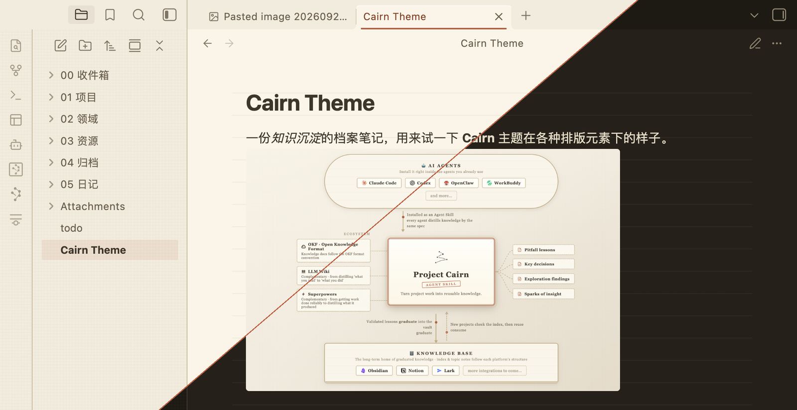

# Cairn

*语言切换： [English](README.md) | **中文***



一个 Obsidian 的牛皮纸档案主题——让你的知识库看起来像摆在暖色书桌上的一张张实体文件。

暖色的纸张中性色、棕色墨水、单一的赭红色强调色，配上干净的无衬线字体。圆角小而带档案感，
阴影是暖棕色而不是冷灰色，表面带着一层淡淡的 CSS 纸张纹理。全篇没有纯白、没有纯黑，
也没有任何冷灰色。

## 截图

五色标注（callout）系统：


引用卡片、代码块、表格与任务列表：


Cairn 实现了 [Project Cairn](https://github.com/iBlinkQ/project-cairn) 设计语言。
它的五种类别色——砖红（元规则）、橄榄（时间线）、赭黄（知识）、灰褐（外部输入）、
青灰（过程物）——被映射到 Obsidian 的 callout 类型上，所以一个标注的配色方式，
和 Cairn 可视化里一张文件卡片的配色方式是一致的。

文件浏览器保留 Obsidian 自身的结构，只套用色板——牛皮纸底色、墨水色标签，
当前打开的文件用赭红色标记。引用块（blockquote）做成带折角的纸卡片。

字号、行宽和间距沿用 Obsidian 自身的约定，而不是设计系统落地页上的数值：
正文 16px、测量宽度 42rem、行高 1.8，标题相对 em 缩放。较宽的字间距作为品牌标志
被保留下来，但只用在标签类文字上——状态栏、表格表头、属性键——这样中文正文
才能保持自己的节奏。

### 字体

Cairn 默认使用系统自带的无衬线字体栈：`-apple-system, "PingFang SC",
"Microsoft YaHei", "Noto Sans SC", sans-serif`。社区主题不能加载远程资源，
所以主题本身不会拉取任何网络字体——字体栈会按顺序落到你系统里实际有的无衬线字体上。

如果想换字体，去 **设置 → 外观 → 字体**（正文、界面、等宽分别设置）。Cairn 只是
填充 Obsidian 主题自带的字体位，所以你在那里的选择永远优先——标题和行内标题也会
跟着变。不需要装任何插件。

## 安装

**从 Obsidian 内安装**——设置 → 外观 → 主题 → 管理 → 搜索 `Cairn`。

**手动安装**——从[最新的 release](../../releases/latest) 里下载 `manifest.json`
和 `theme.css`，放进 `<vault>/.obsidian/themes/Cairn/`，然后在设置 → 外观里选中 Cairn。

## 自定义

安装 [Style Settings](https://github.com/obsidian-community/obsidian-style-settings)
插件，就可以不写 CSS 直接调整 Cairn：

- 强调色、笔记表面色、桌面表面色、墨水色和分隔线颜色（浅色/深色分别设置）
- 默认字体栈、行高、行宽
- 圆角大小
- 纸张材质——ruled（有横线）/ aged（做旧）/ plain（纯色）/ flat（去掉所有纹理），
  以及横线颜色、做旧色调和引用卡纸张效果、纯色引用（去掉引用块卡片外观）、
  内部链接加下划线、界面变暗、方块光标

## 开发

源码放在 `src/` 里，按编号拆成多个模块；仓库根目录的 `theme.css` 是拼接后的构建
产物，不要手动编辑它。

```bash
npm run build   # src/ -> theme.css
npm run sync    # 构建后复制到测试库
npm run dev     # 每次改动后自动重新构建并同步
npm run check   # 构建后按 Obsidian 主题规范做检查
```

`npm run check` 会在出现 `!important`、`@import`、`url()` 里的远程资源、
括号不配对、或者缺少浅色/深色任一区块时让构建失败——这些正是社区主题目录审核会
检查的项目。它还会读取 `src/02-color-light.css` 和 `src/03-color-dark.css` 里的
色板，如果某个文字颜色在它实际所处的背景上低于 WCAG AA 标准（4.5:1）对比度，
也会失败。有两个值被豁免，`contrast.mjs` 里写明了各自的原因。

深色模式是一个扩展，不是设计源头——Cairn 设计系统本身只提供浅色。深色色板全程
保留品牌的暖棕色倾向。

同步目标默认是 iCloud 下的 `TestVault`。可以用 `OBSIDIAN_THEME_DIR` 环境变量
指向别的位置：

```bash
OBSIDIAN_THEME_DIR="/path/to/vault/.obsidian/themes/Cairn" npm run dev
```

`theme.css` 一变化，Obsidian 会立刻重新加载。`manifest.json` 的改动需要重启应用。

### 发布新版本

```bash
npm version patch   # 同时更新 package.json、manifest.json 和 versions.json
git push --follow-tags
```

发布的 GitHub Actions 会构建主题，并把 `manifest.json` 和 `theme.css` 附到同版本号
的 GitHub release 上。

## 许可

MIT
